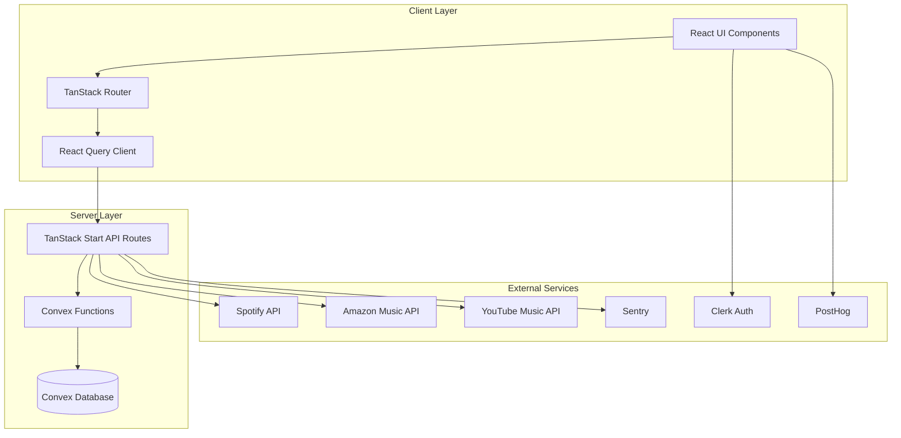
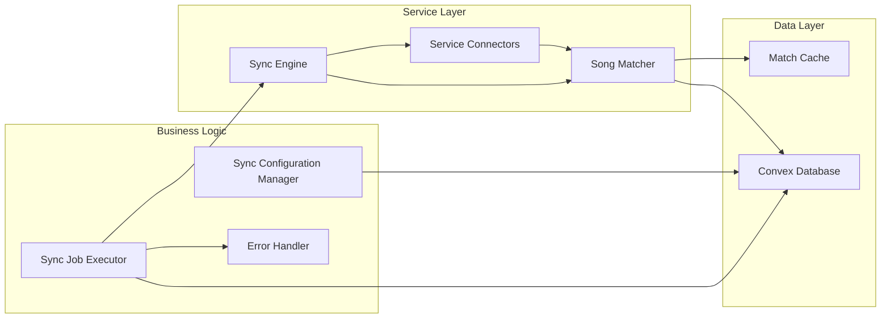

# Design Document: Playlist Sync App

## Overview

The Playlist Sync App is a full-stack web application that enables users to synchronize music playlists across multiple streaming services (Spotify, Amazon Music, YouTube Music). The system provides three synchronization modes (one-time copy, bidirectional sync, one-way sync), intelligent song matching using ISRC codes and metadata similarity, comprehensive error handling with manual resolution, and a dashboard for monitoring sync status and history.

The application is built using Tanstack Start for the full-stack framework, Convex for the backend database and real-time capabilities, Clerk for authentication, shadcn/ui with Tailwind CSS for the UI, Vitest for unit testing, Playwright for end-to-end testing, Sentry for error tracking, and PostHog for user analytics.

### Key Design Goals

1. **Accurate Song Matching**: Prioritize ISRC-based matching with intelligent metadata fallback using string similarity algorithms
2. **Flexible Sync Modes**: Support one-time copy, bidirectional sync, and one-way sync with appropriate change detection
3. **Robust Error Handling**: Gracefully handle matching failures, API errors, and service outages with user intervention options
4. **Performance**: Optimize for large playlists using batching, caching, and background processing
5. **User Experience**: Provide clear visibility into sync status, errors, and history with intuitive manual resolution

## Architecture

### System Architecture

The application follows a modern full-stack architecture with clear separation between client, server, and external services:



### Component Architecture



### Technology Stack Rationale

- **Tanstack Start**: Full-stack React framework with SSR, file-based routing, and API routes
- **Convex**: Real-time database with built-in functions, subscriptions, and scheduled jobs for automatic syncs
- **Clerk**: Authentication provider with OAuth support for music service integrations
- **shadcn/ui + Tailwind CSS**: Component library for consistent, accessible UI
- **Vitest**: Fast unit testing with React Testing Library integration
- **Playwright**: End-to-end testing for critical user flows
- **Sentry**: Error tracking and performance monitoring
- **PostHog**: User analytics and feature flags

## Components and Interfaces

### Service Connector Interface

Each music service (Spotify, Amazon Music, YouTube Music) requires a connector that implements a common interface:

```typescript
interface ServiceConnector {
  // Authentication
  authenticate(userId: string): Promise<AuthResult>;
  refreshToken(userId: string): Promise<AuthResult>;
  disconnect(userId: string): Promise<void>;
  
  // Playlist operations
  getPlaylists(userId: string): Promise<Playlist[]>;
  getPlaylistTracks(playlistId: string): Promise<Track[]>;
  addTracksToPlaylist(playlistId: string, tracks: Track[]): Promise<void>;
  removeTracksFromPlaylist(playlistId: string, trackIds: string[]): Promise<void>;
  
  // Search and matching
  searchTrack(query: SearchQuery): Promise<TrackMatch[]>;
  searchByISRC(isrc: string): Promise<Track | null>;
}

interface AuthResult {
  success: boolean;
  accessToken?: string;
  refreshToken?: string;
  expiresAt?: Date;
  error?: string;
}

interface Playlist {
  id: string;
  name: string;
  service: MusicService;
  trackCount: number;
  lastModified: Date;
}

interface Track {
  id: string;
  title: string;
  artist: string;
  album: string;
  isrc?: string;
  explicit: boolean;
  durationMs: number;
}

interface SearchQuery {
  title: string;
  artist: string;
  album?: string;
  explicit?: boolean;
}

interface TrackMatch {
  track: Track;
  confidence: number; // 0-100
  matchType: 'isrc' | 'metadata';
}
```

### Song Matcher Component

The Song Matcher is responsible for finding the best match for a track on a target service:

```typescript
interface SongMatcher {
  findMatch(
    sourceTrack: Track,
    targetService: MusicService,
    options: MatchOptions
  ): Promise<MatchResult>;
  
  calculateMetadataScore(
    source: Track,
    candidate: Track
  ): number;
}

interface MatchOptions {
  preferExplicit?: boolean;
  minConfidence?: number;
}

interface MatchResult {
  match?: TrackMatch;
  candidates: TrackMatch[];
  error?: MatchError;
}

type MatchError = 
  | 'no_candidates'
  | 'low_confidence'
  | 'version_mismatch'
  | 'service_error';
```

The matching algorithm follows this priority:

1. **ISRC Match**: If source track has ISRC, search target service by ISRC
2. **Metadata Match**: Search by title + artist + album, calculate similarity scores
3. **Confidence Scoring**: 
   - Title similarity: 50% weight
   - Artist similarity: 35% weight
   - Album similarity: 15% weight
4. **Version Filtering**: Prioritize explicit/clean version based on source
5. **Threshold Application**: 
   - ≥95%: High confidence (auto-select)
   - 70-94%: Medium confidence (require user review)
   - <70%: Low confidence (require user review)

String similarity will use Levenshtein distance normalized to 0-100 scale.

### Sync Engine Component

The Sync Engine orchestrates the synchronization process:

```typescript
interface SyncEngine {
  executeSync(configId: string): Promise<SyncResult>;
  detectChanges(
    config: SyncConfiguration,
    lastSync: Date
  ): Promise<ChangeSet>;
  applyChanges(
    changes: ChangeSet,
    config: SyncConfiguration
  ): Promise<SyncResult>;
}

interface SyncConfiguration {
  id: string;
  userId: string;
  mode: SyncMode;
  sourcePlaylists: PlaylistRef[];
  targetPlaylists: PlaylistRef[];
  schedule?: SyncSchedule;
  lastSyncAt?: Date;
  createdAt: Date;
}

type SyncMode = 'one-time-copy' | 'bidirectional' | 'one-way';

interface PlaylistRef {
  playlistId: string;
  service: MusicService;
}

interface SyncSchedule {
  enabled: boolean;
  frequency: 'hourly' | 'daily' | 'weekly';
  nextRunAt: Date;
}

interface ChangeSet {
  additions: Map<string, Track[]>; // playlistId -> tracks to add
  removals: Map<string, string[]>; // playlistId -> trackIds to remove
}

interface SyncResult {
  success: boolean;
  tracksAdded: number;
  tracksRemoved: number;
  errors: SyncError[];
  duration: number;
}

interface SyncError {
  id: string;
  sourceTrack: Track;
  targetPlaylist: PlaylistRef;
  errorType: MatchError;
  candidates: TrackMatch[];
  status: 'unresolved' | 'resolved' | 'skipped';
  manualMatch?: Track;
}
```

### Sync Job Executor

Convex scheduled functions will handle automatic sync execution:

```typescript
// Convex function for scheduled syncs
interface SyncJobExecutor {
  scheduleSync(configId: string, schedule: SyncSchedule): Promise<void>;
  cancelScheduledSync(configId: string): Promise<void>;
  executeSyncJob(configId: string): Promise<SyncResult>;
  retryFailedSync(configId: string, attempt: number): Promise<SyncResult>;
}
```

### UI Components

Key UI components for the application:

1. **Service Connection Panel**: OAuth flow initiation, connection status
2. **Playlist Browser**: Display playlists grouped by service with search/filter
3. **Sync Configuration Form**: Select source/target playlists, choose sync mode, set schedule
4. **Sync Dashboard**: Overview of all sync configs with status indicators
5. **Sync History View**: Timeline of sync jobs with details
6. **Error Resolution Modal**: Display unmatched tracks with candidates, search, and manual selection
7. **Progress Indicator**: Real-time sync progress with track counts

## Data Models

### Convex Schema

```typescript
// Users table (managed by Clerk)
interface User {
  _id: Id<"users">;
  clerkId: string;
  email: string;
  createdAt: number;
}

// Service connections
interface ServiceConnection {
  _id: Id<"serviceConnections">;
  userId: Id<"users">;
  service: MusicService;
  accessToken: string; // Encrypted
  refreshToken: string; // Encrypted
  expiresAt: number;
  connectedAt: number;
  lastRefreshedAt: number;
}

// Cached playlists
interface CachedPlaylist {
  _id: Id<"cachedPlaylists">;
  userId: Id<"users">;
  service: MusicService;
  externalId: string; // Playlist ID from the service
  name: string;
  trackCount: number;
  lastFetchedAt: number;
  lastModifiedAt: number;
}

// Sync configurations
interface SyncConfiguration {
  _id: Id<"syncConfigurations">;
  userId: Id<"users">;
  name: string;
  mode: SyncMode;
  sourcePlaylists: PlaylistRef[];
  targetPlaylists: PlaylistRef[];
  schedule?: {
    enabled: boolean;
    frequency: 'hourly' | 'daily' | 'weekly';
    nextRunAt: number;
  };
  lastSyncAt?: number;
  createdAt: number;
  updatedAt: number;
}

// Sync jobs (history)
interface SyncJob {
  _id: Id<"syncJobs">;
  configId: Id<"syncConfigurations">;
  userId: Id<"users">;
  status: 'running' | 'completed' | 'failed';
  startedAt: number;
  completedAt?: number;
  duration?: number;
  tracksAdded: number;
  tracksRemoved: number;
  errorCount: number;
}

// Sync errors
interface SyncError {
  _id: Id<"syncErrors">;
  jobId: Id<"syncJobs">;
  configId: Id<"syncConfigurations">;
  userId: Id<"users">;
  sourceTrack: {
    title: string;
    artist: string;
    album: string;
    isrc?: string;
    explicit: boolean;
  };
  targetPlaylist: PlaylistRef;
  errorType: 'no_candidates' | 'low_confidence' | 'version_mismatch' | 'service_error';
  candidates: Array<{
    trackId: string;
    title: string;
    artist: string;
    album: string;
    confidence: number;
  }>;
  status: 'unresolved' | 'resolved' | 'skipped';
  manualMatch?: {
    trackId: string;
    title: string;
    artist: string;
  };
  createdAt: number;
  resolvedAt?: number;
}

// Match cache
interface MatchCache {
  _id: Id<"matchCache">;
  sourceService: MusicService;
  sourceTrackId: string;
  targetService: MusicService;
  targetTrackId: string;
  confidence: number;
  matchType: 'isrc' | 'metadata';
  cachedAt: number;
  expiresAt: number; // 7 days from cachedAt
}

type MusicService = 'spotify' | 'amazon-music' | 'youtube-music';

interface PlaylistRef {
  playlistId: string;
  service: MusicService;
}

type SyncMode = 'one-time-copy' | 'bidirectional' | 'one-way';
```

### Database Indexes

Key indexes for performance:

- `serviceConnections`: `by_user_and_service(userId, service)`
- `cachedPlaylists`: `by_user_and_service(userId, service)`, `by_external_id(service, externalId)`
- `syncConfigurations`: `by_user(userId)`, `by_next_run(schedule.nextRunAt)`
- `syncJobs`: `by_config(configId)`, `by_user_and_date(userId, startedAt)`
- `syncErrors`: `by_job(jobId)`, `by_config_and_status(configId, status)`, `by_user_unresolved(userId, status)`
- `matchCache`: `by_source_and_target(sourceService, sourceTrackId, targetService)`

### State Management

Client-side state will be managed using:

1. **React Query**: Server state caching and synchronization
2. **TanStack Router**: URL state for navigation and filters
3. **React Hook Form**: Form state for sync configuration
4. **Local component state**: UI-only state (modals, dropdowns, etc.)

